# Organograma JHabib 2.0 — Hub & Spoke com 4 Níveis

> Owner: [[coo-daniel-santos|COO Daniel Santos]] · ISO 45001 Clause 5.3 + ISO 9001 Clause 5.3
> Spec: [[2026-03-25-org-chart-design]]

---

## Diagrama Organizacional

```mermaid
graph TD
    JEAN["👤 Jean Habib<br/>Founder / CEO<br/>ISO 9001 · 42001 · 56001"]

    subgraph "Nível 1 — Estratégico (C-Level Board)"
        CTO["🤖 CTO Alex Chen<br/>ISO/IEC 42001"]
        CPO["🤖 CPO Lena Park<br/>ISO/IEC 25010"]
        CMO["🤖 CMO Sofia Reyes<br/>ISO 56001"]
        CFO["🤖 CFO Marcus Lima<br/>ISO 31000"]
        COO["🤖 COO Daniel Santos<br/>ISO 45001"]
        CRO["🤖 CRO Rafael Souza<br/>ISO 56001"]
        CISO["🤖 CISO Priya Nair<br/>ISO/IEC 27001"]
    end

    JEAN --> CTO
    JEAN --> CPO
    JEAN --> CMO
    JEAN --> CFO
    JEAN --> COO
    JEAN --> CRO
    JEAN --> CISO

    subgraph "Nível 2 — Tático (Pilares)"
        P_IADS["IA & Data Science"]
        P_ESDD["Engenharia & SDD"]
        P_QA["QA & Testes"]
        P_PMO["PMO & Delivery"]
        P_PROD["Produto & UX"]
        P_GTM["Consultoria & GTM"]
        P_FIN["Financeiro & Risco"]
        P_SEC["Security & Compliance"]
    end

    CTO --> P_IADS
    CTO --> P_ESDD
    CTO --> P_QA
    COO --> P_PMO
    CPO --> P_PROD
    CMO --> P_GTM
    CRO --> P_GTM
    CFO --> P_FIN
    CISO --> P_SEC

    subgraph "Nível 3 — Operacional (SKILLs)"
        S_LLM["llm-benchmark"]
        S_RAG["eval-rag"]
        S_PHX["phoenix-trace"]
        S_ORC["orchestrator"]
        S_ENV["env-doctor"]
        S_DRF["check-drift"]
        S_SMK["smoke-test"]
        S_SSC["security-scan"]
        S_NST["nist-audit"]
        S_RET["retrospective"]
        S_TOD["today"]
    end

    P_IADS --> S_LLM
    P_IADS --> S_RAG
    P_IADS --> S_PHX
    P_ESDD --> S_ORC
    P_ESDD --> S_ENV
    P_ESDD --> S_DRF
    P_QA --> S_SMK
    P_QA --> S_SSC
    P_QA --> S_NST
    P_PMO --> S_RET
    P_PMO --> S_TOD
    P_SEC -.-> S_SSC
    P_SEC -.-> S_NST

    subgraph "Nível 4 — Suporte (Funções cross-cutting)"
        SUP_SEC["🔒 Security & Compliance<br/>CISO Priya Nair<br/>(transversal)"]
        SUP_HR["💚 Anti-burnout & HR<br/>COO Daniel Santos<br/>(transversal)"]
    end

    SUP_SEC -.->|audita| P_IADS
    SUP_SEC -.->|audita| P_ESDD
    SUP_SEC -.->|audita| P_QA
    SUP_SEC -.->|audita| P_PMO
    SUP_SEC -.->|audita| P_PROD
    SUP_SEC -.->|audita| P_GTM
    SUP_SEC -.->|audita| P_FIN
    SUP_HR -.->|monitora| JEAN
    SUP_HR -.->|monitora| P_IADS
    SUP_HR -.->|monitora| P_ESDD
    SUP_HR -.->|monitora| P_QA
    SUP_HR -.->|monitora| P_PMO
```

---

## Estrutura — 4 Níveis

### Nível 1: Estratégico (C-Level Board)

| Role | Nome | ISO Primária | Domínio | Estado |
|------|------|-------------|---------|-------|
| **Founder/CEO** | Jean Habib | ISO 9001, 42001, 56001 | Decisão final, budget ≤5h/semana, cliente | — |
| **CTO** | Alex Chen | ISO/IEC 42001, 25010 | SDD, stack, ADRs, métrica Q | [[cto-alex-chen]] |
| **CPO** | Lena Park | ISO/IEC 25010 | Portfólio de produtos, roadmap, discovery | [[cpo-lena-park]] |
| **CMO** | Sofia Reyes | ISO 56001 | Go-to-market BR/US, ICP, pricing | [[cmo-sofia-reyes]] |
| **CFO** | Marcus Lima | ISO 31000 | $5k/mês target, SAC snowball, riscos | [[cfo-marcus-lima]] |
| **COO** | Daniel Santos | ISO 45001 | Ops, anti-burnout, ≤5h/semana, org chart | [[coo-daniel-santos]] |
| **CRO** | Rafael Souza | ISO 56001 | Pipeline de clientes, contratos, V1→V2→V3 | [[cro-rafael-souza]] |
| **CISO** | Priya Nair | ISO/IEC 27001 | Segurança, privacidade, compliance | [[ciso-priya-nair]] |

### Nível 2: Tático (Pilares)

| Pilar | Owner | Escopo |
|-------|-------|--------|
| **IA & Data Science** | CTO | Modelos, benchmarks, tracing, RAG evaluation |
| **Engenharia & SDD** | CTO | Orquestração SDD, infra, drift detection |
| **QA & Testes** | CTO | Smoke tests, security scans, NIST compliance |
| **PMO & Delivery** | COO | Retrospectivas, daily briefings, sessions |
| **Produto & UX** | CPO | Product discovery, protótipos, roadmap |
| **Consultoria & GTM** | CMO + CRO | Pipeline, demos, FAPEMA, ativação comercial |
| **Financeiro & Risco** | CFO | Projeções, SAC, análise de custo |
| **Security & Compliance** | CISO | AI policy, data governance, risk register |

### Nível 3: Operacional (11 SKILLs)

| SKILL | Pilar | Função |
|-------|-------|--------|
| [[skills/orchestrator/orchestrator\|orchestrator]] | Engenharia & SDD | Ciclo SDD FASE 0-7 |
| [[skills/llm-benchmark/llm-benchmark\|llm-benchmark]] | IA & Data Science | Comparação de modelos |
| [[skills/eval-rag/eval-rag\|eval-rag]] | IA & Data Science | Avaliação RAG |
| [[skills/phoenix-trace/phoenix-trace\|phoenix-trace]] | IA & Data Science | Tracing LLM |
| [[skills/smoke-test/smoke-test\|smoke-test]] | QA & Testes | Validação E2E |
| [[skills/security-scan/security-scan\|security-scan]] | QA + Security | ISO/IEC 27001 |
| [[skills/nist-audit/nist-audit\|nist-audit]] | QA + Security | NIST Cybersecurity |
| [[skills/env-doctor/env-doctor\|env-doctor]] | Engenharia & SDD | Validação de ambiente |
| [[skills/check-drift/check-drift\|check-drift]] | Engenharia & SDD | Drift detection |
| [[skills/retrospective/retrospective\|retrospective]] | PMO & Delivery | Automação de retro |
| [[skills/today/today-skill\|today]] | PMO & Delivery | Daily briefing |

**Pilares sem SKILLs dedicadas** (C-Level atua diretamente):
- **Produto & UX** — CPO Lena Park
- **Consultoria & GTM** — CMO Sofia Reyes + CRO Rafael Souza
- **Financeiro & Risco** — CFO Marcus Lima
- **Security & Compliance** — CISO Priya Nair (servida por `security-scan` + `nist-audit`)

### Nível 4: Suporte (Cross-cutting)

> Funções transversais de C-Levels do Nível 1, não posições adicionais.

| Função | Owner | Atua sobre |
|--------|-------|-----------|
| **Security & Compliance** | CISO Priya Nair | Todos os 8 pilares |
| **Anti-burnout & HR** | COO Daniel Santos | Jean + todos os agentes |

---

## Matriz GRACI

Framework GRACI = RACI + **G**overnance + **V**erification para empresas AI-first.

| Letra | Significado |
|-------|-------------|
| **R** | Responsible — executa o trabalho |
| **A** | Accountable — responde pelo resultado (sempre Jean) |
| **C** | Consulted — fornece input antes da execução |
| **I** | Informed — notificado do resultado |
| **G** | Governance — aprova quais tools/modelos de IA podem ser usados |
| **V** | Verification — valida output da IA antes de aprovar |

### Matriz por Tipo de Decisão

| Decisão/Tarefa | Jean | CTO | CPO | CMO | CFO | COO | CRO | CISO | Mode |
|---------------|------|-----|-----|-----|-----|-----|-----|------|------|
| Criação de ADR | A, G, V | R | C | I | I | I | I | C | AI-assisted |
| Novo produto/feature | A, G | C | R | C | C | I | C | I | AI-assisted |
| Roadmap trimestral | A, V | C | R | C | C | C | C | I | AI-assisted |
| Projeção financeira | A, V | I | I | I | R | I | C | I | AI-assisted |
| Análise de risco | A, V | C | I | I | R | C | I | C | AI-assisted |
| Pipeline de clientes | A, V | I | I | C | I | I | R | I | AI-assisted |
| Go-to-market | A, G | I | C | R | C | I | C | I | AI-assisted |
| Contrato/invoice | A | I | I | I | R | I | R | I | Human-only |
| Comunicação c/ cliente | R, A | I | I | C | I | I | C | I | Human-only |
| SKILL authoring | A, G, V | R | C | I | I | I | I | C | AI-assisted |
| Security scan | A, V | C | I | I | I | I | I | R | AI-assisted |
| AI Policy | A, G, V | C | I | I | I | I | I | R | AI-assisted |
| Código em forks | A, G | I | I | I | I | I | I | I | Handoff |
| Budget semanal | A | I | I | I | I | R, V | I | I | AI-assisted |
| Anti-burnout check | A* | I | I | I | I | R, V | I | I | AI-only |
| Session log | A | I | I | I | I | R | I | I | AI-assisted |
| Retrospectiva | A, V | C | C | C | I | R | I | I | AI-assisted |
| Deploy/go-live | A, G, V | R | C | C | I | C | I | C | AI-assisted |

**Regra fundamental:** Jean é SEMPRE Accountable (A).

> **\*Anti-burnout exception:** COO tem autoridade de override em questões de saúde ocupacional (ISO 45001). O COO pode bloquear trabalho mesmo sem aprovação do Jean — única exceção ao modelo.

---

## Canais de Comunicação

| Canal | Propósito | Direção | Frequência |
|-------|-----------|---------|-----------|
| `CLAUDE.md` | Estratégia, regras, contexto | Jean → Agentes | Atualizado por sessão |
| `HOME.md` | Briefing rápido de sessão | Agentes → Jean | Lido a cada sessão |
| `AGORA.md` | Estado real-time dos forks | Bidirecional | Cada sessão |
| Session logs | Decisões, retros, handoffs | Agente → Jean | Por sessão |
| Handoff docs | Coordenação cross-repo | Jean ↔ Fork agents | Por tarefa |
| ADRs | Decisões arquiteturais | Colaborativo | Quando necessário |
| State docs (`*-state.md`) | Estado por C-Level | C-Level → Jean | Por sessão |
| Notion | Execução visual, kanban | Bidirecional | Contínuo |
| `pipeline.md` | Pipeline CRO | CRO → Jean | Por sessão |

---

## Regras de Escalação

### Escala para Jean quando:

1. **Impacto financeiro** — invoice, contrato, aporte
2. **Client-facing** — comunicação direta com stakeholder externo
3. **Irreversibilidade** — deploy, push main, merge PR
4. **Conflito entre C-Levels** — discordância sobre prioridade
5. **Budget excedido** — ação excede horas semanais restantes
6. **Novo compromisso** — promessa de prazo a stakeholder externo

### Autonomia dos AI Agents:

1. Análise e recomendação — livremente
2. Criação de docs internos — session logs, state docs, retros
3. Consulta entre C-Levels — sem escalar
4. Atualização de estado — AGORA.md, pipeline.md, state docs
5. Anti-burnout alert — COO pode alertar sem esperar Jean

---

## Referências Cruzadas

### Estratégia
- [[vision]] — Missão, portfólio de produtos, C-Level Board
- [[financial-goals]] — Meta $5k/mês + SAC snowball
- [[cmo-sofia-reyes]] — Go-to-market BR/US (CMO Sofia Reyes)

### Metodologia
- [[sdd-overview]] — Spec-Driven Development
- [[zhc-overview]] — Zero Human Companies
- [[golden-rules]] — 10 Regras de Ouro SDD
- [[gate-pre-pr]] — Gate Pre-PR inviolável

### ADRs Vigentes
- [[ADR-010-e2e-obrigatorio-llm|ADR-010]] — E2E obrigatório para LLM stories
- [[ADR-015-qa-ui-obrigatorio|ADR-015]] — QA UI obrigatório
- [[ADR-018-sdd-express-pre-receita|ADR-018]] — SDD Express pré-receita
- [[ADR-019-jhab20-studio-framework|ADR-019]] — JHabib 2.0 como Studio Framework
- [[ADR-006-sdd-pipeline|ADR-006]] — SDD Pipeline
- [[ADR-008-dois-planos-dev-produto|ADR-008]] — Dois planos dev/produto
- [[ADR-016-dois-contextos-runtime-evals|ADR-016]] — Dois contextos runtime/evals

### Produtos
- [[02-products/restaurante-ia-ops/restaurante-ia-ops|Restaurante iA Ops (V1)]]
- [[02-products/qaai-augment/qaai-augment|QAi Augment (plataforma)]]

### Clientes
- [[03-clients/jakaru-restaurante-ia-ops/jakaru-felipe|Jakaru Food Park (Felipe)]]

### Anti-Patterns & Auditoria
- [[01-methodology/anti-patterns/anti-patterns|Catálogo de Anti-Patterns]]
- [[AUDIT-2026-03-23]] — Auditoria completa

### Referência
- [[README]] — GitHub README do projeto
- [[05-sessions/research-org-chart-comms-2026-03-25|Research: Org Chart & Comunicação]]

---

## Fontes

- [Sociis RH — Comunicação Interna](https://sociisrh.com.br/comunicacao-interna/)
- [CIO.com — AI-Native Roles](https://www.cio.com/article/4060162/)
- [Yields.io — RACI for AI Governance](https://www.yields.io/blog/raci-matrix-ai-governance/)
- [CIPH Lab — GRACI Framework](https://www.ciph-lab.com/ai-governance-raci)
- ISO 9001 Clause 5.3 · ISO 45001 Clause 5.3
- Estrutura de consultoria TI com IA + SDD (referência Jean)
