# Spec: Organograma JHabib 2.0 — Hub & Spoke com 4 Níveis + GRACI

**Data:** 2026-03-25
**Owner:** COO Daniel Santos (ISO 45001 Clause 5.3)
**Status:** Approved

---

## 1. Problema

O JHabib 2.0 tem 7 C-Levels + 11 SKILLs + 1 Founder, mas:
- Nenhum organograma formal (ISO 9001/45001 exigem)
- Nenhuma matriz de decisão (quem decide o quê, com que autonomia)
- Nenhum fluxo de comunicação documentado (canais, frequência, direção)
- Nenhuma hierarquia entre SKILLs e C-Levels (quem subordina a quem)

Isso gera ambiguidade quando o agente precisa decidir quem consultar, quem escalar, e quem é responsável por cada tipo de entrega.

## 2. Solução

Criar `00-strategy/org-chart.md` com:
1. Diagrama Mermaid do organograma (4 níveis)
2. Matriz GRACI (accountability AI-first)
3. Mapa de canais de comunicação
4. Regras de escalação

Espelhar no Notion como página "Organograma JHabib 2.0".

## 3. Estrutura Organizacional — 4 Níveis

### Nível 1: Estratégico (C-Level Board)

| Role | Nome | ISO Primária | Domínio |
|------|------|-------------|---------|
| **Founder/CEO** | Jean Habib | ISO 9001, 42001, 56001 | Decisão final, budget ≤5h/semana, cliente |
| **CTO** | Alex Chen | ISO/IEC 42001, 25010 | SDD, stack, ADRs, métrica Q |
| **CPO** | Lena Park | ISO/IEC 25010 | Portfólio de produtos, roadmap, discovery |
| **CMO** | Sofia Reyes | ISO 56001 | Go-to-market BR/US, ICP, pricing |
| **CFO** | Marcus Lima | ISO 31000 | $5k/mês target, SAC snowball, riscos |
| **COO** | Daniel Santos | ISO 45001 | Ops, anti-burnout, ≤5h/semana, org chart |
| **CRO** | Rafael Souza | ISO 56001 | Pipeline de clientes, contratos, V1→V2→V3 |
| **CISO** | Priya Nair | ISO/IEC 27001 | Segurança, privacidade, compliance |

### Nível 2: Tático (Pilares/Gerências)

Cada pilar agrupa SKILLs e atividades sob a responsabilidade de um C-Level.

| Pilar | Owner (C-Level) | Escopo |
|-------|----------------|--------|
| **IA & Data Science** | CTO Alex Chen | Modelos, benchmarks, tracing, RAG evaluation |
| **Engenharia & SDD** | CTO Alex Chen | Orquestração SDD, infra, drift detection |
| **QA & Testes** | CTO Alex Chen | Smoke tests, security scans, NIST compliance |
| **PMO & Delivery** | COO Daniel Santos | Retrospectivas, daily briefings, session management |
| **Produto & UX** | CPO Lena Park | Product discovery, protótipos, roadmap |
| **Consultoria & GTM** | CMO Sofia Reyes + CRO Rafael Souza | Pipeline, demos, FAPEMA, ativação comercial |
| **Financeiro & Risco** | CFO Marcus Lima | Projeções, SAC, análise de custo |
| **Security & Compliance** | CISO Priya Nair | AI policy, data governance, risk register |

### Nível 3: Operacional (SKILLs = Especialistas)

11 SKILLs ativas, distribuídas em 4 pilares. Os pilares Produto & UX, Consultoria & GTM, Financeiro & Risco e Security & Compliance operam atualmente sem SKILLs dedicadas — os C-Levels owners atuam diretamente. SKILLs futuras serão criadas conforme demanda (just-in-time).

| SKILL | Pilar | Função | Equivalente Tradicional |
|-------|-------|--------|------------------------|
| `orchestrator` | Engenharia & SDD | Ciclo SDD FASE 0-7 | Scrum Master + Tech Lead |
| `llm-benchmark` | IA & Data Science | Comparação de modelos | ML Engineer |
| `eval-rag` | IA & Data Science | Avaliação RAG | Data Scientist |
| `phoenix-trace` | IA & Data Science | Tracing/observabilidade LLM | MLOps Engineer |
| `smoke-test` | QA & Testes | Validação end-to-end | QA Engineer |
| `security-scan` | QA & Testes + Security & Compliance | ISO/IEC 27001 compliance | Security Analyst |
| `nist-audit` | QA & Testes + Security & Compliance | NIST Cybersecurity audit | Compliance Analyst |
| `env-doctor` | Engenharia & SDD | Validação de ambiente | DevOps Engineer |
| `check-drift` | Engenharia & SDD | Drift detection | Infrastructure Engineer |
| `retrospective` | PMO & Delivery | Automação de retro | Agile Coach |
| `today` | PMO & Delivery | Daily briefing | Project Manager |

**Pilares sem SKILLs dedicadas (C-Level atua diretamente):**
- **Produto & UX** — CPO Lena Park (futuro: `product-discovery`, `ux-audit`)
- **Consultoria & GTM** — CMO Sofia Reyes + CRO Rafael Souza (futuro: `lead-scoring`, `demo-prep`)
- **Financeiro & Risco** — CFO Marcus Lima (futuro: `financial-projection`, `risk-assessment`)
- **Security & Compliance** — CISO Priya Nair (já servida por `security-scan` e `nist-audit` do pilar QA)

### Nível 4: Suporte (Cross-cutting)

> **Nota:** O Nível 4 não são posições adicionais. São **funções transversais** exercidas por C-Levels do Nível 1 que atuam como auditores/monitores de todos os outros pilares.

| Função | Owner (C-Level Nível 1) | Escopo | Atua sobre |
|--------|------------------------|--------|-----------|
| **Security & Compliance** | CISO Priya Nair | Ética IA, LGPD, ISO 27001 | Todos os 8 pilares |
| **Anti-burnout & HR** | COO Daniel Santos | ≤5h/semana, ISO 45001, sem trabalho após 22h | Jean + todos os agentes |

## 4. Diagrama Mermaid

```mermaid
graph TD
    JEAN["👤 Jean Habib<br/>Founder / CEO<br/>ISO 9001 · 42001 · 56001"]

    subgraph "Nível 1 — Estratégico (C-Level Board)"
        CTO["🤖 CTO Alex Chen<br/>ISO/IEC 42001"]
        CPO["🤖 CPO Lena Park<br/>ISO/IEC 25010"]
        CMO["🤖 CMO Sofia Reyes<br/>ISO 56001"]
        CFO["🤖 CFO Marcus Lima<br/>ISO 31000"]
        COO["🤖 COO Daniel Santos<br/>ISO 45001"]
        CRO["🤖 CRO Rafael Souza<br/>ISO 56001"]
        CISO["🤖 CISO Priya Nair<br/>ISO/IEC 27001"]
    end

    JEAN --> CTO
    JEAN --> CPO
    JEAN --> CMO
    JEAN --> CFO
    JEAN --> COO
    JEAN --> CRO
    JEAN --> CISO

    subgraph "Nível 2 — Tático (Pilares)"
        P_IADS["IA & Data Science"]
        P_ESDD["Engenharia & SDD"]
        P_QA["QA & Testes"]
        P_PMO["PMO & Delivery"]
        P_PROD["Produto & UX"]
        P_GTM["Consultoria & GTM"]
        P_FIN["Financeiro & Risco"]
        P_SEC["Security & Compliance"]
    end

    CTO --> P_IADS
    CTO --> P_ESDD
    CTO --> P_QA
    COO --> P_PMO
    CPO --> P_PROD
    CMO --> P_GTM
    CRO --> P_GTM
    CFO --> P_FIN
    CISO --> P_SEC

    subgraph "Nível 3 — Operacional (SKILLs)"
        S_LLM["llm-benchmark"]
        S_RAG["eval-rag"]
        S_PHX["phoenix-trace"]
        S_ORC["orchestrator"]
        S_ENV["env-doctor"]
        S_DRF["check-drift"]
        S_SMK["smoke-test"]
        S_SSC["security-scan"]
        S_NST["nist-audit"]
        S_RET["retrospective"]
        S_TOD["today"]
    end

    P_IADS --> S_LLM
    P_IADS --> S_RAG
    P_IADS --> S_PHX
    P_ESDD --> S_ORC
    P_ESDD --> S_ENV
    P_ESDD --> S_DRF
    P_QA --> S_SMK
    P_QA --> S_SSC
    P_QA --> S_NST
    P_PMO --> S_RET
    P_PMO --> S_TOD
    P_SEC -.-> S_SSC
    P_SEC -.-> S_NST

    subgraph "Nível 4 — Suporte (Funções cross-cutting)"
        SUP_SEC["🔒 Security & Compliance<br/>CISO Priya Nair<br/>(transversal)"]
        SUP_HR["💚 Anti-burnout & HR<br/>COO Daniel Santos<br/>(transversal)"]
    end

    SUP_SEC -.->|audita| P_IADS
    SUP_SEC -.->|audita| P_ESDD
    SUP_SEC -.->|audita| P_QA
    SUP_SEC -.->|audita| P_PMO
    SUP_SEC -.->|audita| P_PROD
    SUP_SEC -.->|audita| P_GTM
    SUP_SEC -.->|audita| P_FIN
    SUP_HR -.->|monitora| JEAN
    SUP_HR -.->|monitora| P_IADS
    SUP_HR -.->|monitora| P_ESDD
    SUP_HR -.->|monitora| P_QA
    SUP_HR -.->|monitora| P_PMO
```

## 5. Matriz GRACI

Framework GRACI = RACI + Governance (G) + Verification (V) para empresas AI-first.

| Letra | Significado |
|-------|-------------|
| **R** | Responsible — executa o trabalho |
| **A** | Accountable — responde pelo resultado (sempre Jean) |
| **C** | Consulted — fornece input antes da execução |
| **I** | Informed — notificado do resultado |
| **G** | Governance — aprova quais tools/modelos de IA podem ser usados |
| **V** | Verification — valida output da IA antes de aprovar |

### Matriz por Tipo de Decisão

| Decisão/Tarefa | Jean | CTO | CPO | CMO | CFO | COO | CRO | CISO | Mode |
|---------------|------|-----|-----|-----|-----|-----|-----|------|------|
| Criação de ADR | A, G, V | R | C | I | I | I | I | C | AI-assisted |
| Novo produto/feature | A, G | C | R | C | C | I | C | I | AI-assisted |
| Roadmap trimestral | A, V | C | R | C | C | C | C | I | AI-assisted |
| Projeção financeira | A, V | I | I | I | R | I | C | I | AI-assisted |
| Análise de risco | A, V | C | I | I | R | C | I | C | AI-assisted |
| Pipeline de clientes | A, V | I | I | C | I | I | R | I | AI-assisted |
| Go-to-market | A, G | I | C | R | C | I | C | I | AI-assisted |
| Contrato/invoice | A | I | I | I | R | I | R | I | Human-only |
| Comunicação c/ cliente | R, A | I | I | C | I | I | C | I | Human-only |
| SKILL authoring | A, G, V | R | C | I | I | I | I | C | AI-assisted |
| Security scan | A, V | C | I | I | I | I | I | R | AI-assisted |
| AI Policy | A, G, V | C | I | I | I | I | I | R | AI-assisted |
| Código em forks | A, G | I | I | I | I | I | I | I | Handoff |
| Budget semanal | A | I | I | I | I | R, V | I | I | AI-assisted |
| Anti-burnout check | A* | I | I | I | I | R, V | I | I | AI-only |
| Session log | A | I | I | I | I | R | I | I | AI-assisted |
| Retrospectiva | A, V | C | C | C | I | R | I | I | AI-assisted |
| Deploy/go-live | A, G, V | R | C | C | I | C | I | C | AI-assisted |

**Regra fundamental:** Jean é SEMPRE Accountable (A). Nenhum AI agent tem autonomia para decisões irreversíveis sem validação humana.

> **\*Anti-burnout exception:** Jean é Accountable mas o COO tem autoridade de override em questões de saúde ocupacional (ISO 45001). O COO pode bloquear trabalho mesmo sem aprovação do Jean — é a única exceção ao modelo, justificada pela norma.

## 6. Canais de Comunicação

| Canal | Propósito | Direção | Frequência | Equivalente Tradicional |
|-------|-----------|---------|-----------|------------------------|
| `CLAUDE.md` | Estratégia, regras, contexto | Jean → Agentes | Atualizado por sessão | Employee Handbook |
| `HOME.md` | Briefing rápido de sessão | Agentes → Jean | Lido a cada sessão | Daily Standup Board |
| `AGORA.md` | Estado real-time dos forks | Bidirecional | Cada sessão | War Room Dashboard |
| Session logs (`05-sessions/`) | Decisões, retros, handoffs | Agente → Jean (review) | Por sessão de trabalho | Meeting Minutes |
| Handoff docs (`05-sessions/handoffs/`) | Coordenação cross-repo | Jean ↔ Fork agents | Por tarefa cross-repo | Project Handoff |
| ADRs (`01-methodology/adrs/`) | Decisões arquiteturais | Colaborativo | Quando necessário | Architecture Decision Records |
| State docs (`*-state.md`) | Estado por C-Level | C-Level → Jean | Atualizado por sessão | Department Status Reports |
| Notion | Execução visual, kanban | Bidirecional | Contínuo | Project Management Tool |
| `pipeline.md` | Estado do pipeline CRO | CRO → Jean | Atualizado por sessão | CRM Dashboard |

## 7. Regras de Escalação

### Escala para Jean (Human-only) quando:

1. **Impacto financeiro** — qualquer decisão envolvendo dinheiro real (invoice, contrato, aporte)
2. **Client-facing** — comunicação direta com Felipe ou qualquer stakeholder externo
3. **Irreversibilidade** — deploy em produção, push para main, merge de PR
4. **Conflito entre C-Levels** — quando dois C-Levels discordam sobre prioridade
5. **Budget excedido** — quando ação proposta excede as horas semanais restantes
6. **Novo compromisso** — qualquer promessa de prazo ou entrega a stakeholder externo

### Autonomia dos AI Agents (sem escalar):

1. **Análise e recomendação** — C-Levels podem analisar e recomendar livremente
2. **Criação de docs internos** — session logs, state docs, retros
3. **Consulta entre C-Levels** — CTO pode consultar CFO sobre custo sem escalar
4. **Atualização de estado** — atualizar AGORA.md, pipeline.md, state docs
5. **Anti-burnout check** — COO pode alertar sobre budget sem esperar Jean

## 8. Implementação no Notion

Criar página "Organograma JHabib 2.0" no Notion com:
- Diagrama visual (imagem do Mermaid renderizado ou diagrama nativo Notion)
- Database "Matriz GRACI" com propriedades: Decisão, Jean, CTO, CPO, CMO, CFO, COO, CRO, CISO, Mode
- Tabela de canais de comunicação
- Regras de escalação

A página Notion é uma **visão executiva** — Obsidian permanece como fonte de verdade.

## 9. Conexões no Vault (wiki-links)

Arquivos que receberão referência ao org-chart:
- `HOME.md` — link na seção Navegação Rápida → Estratégia
- `VAULT.md` — referência na seção "3 Camadas do Ecossistema"
- `CLAUDE.md` — C-Level Board aponta pra `[[org-chart]]` pra detalhes
- Cada `*-state.md` — backlink: "Ver posição no [[org-chart]]"

## 10. Critério de Done

- [ ] `00-strategy/org-chart.md` criado com Mermaid + GRACI + canais + escalação
- [ ] HOME.md, VAULT.md, CLAUDE.md atualizados com links
- [ ] State docs com backlinks
- [ ] Página Notion criada com mesma estrutura
- [ ] COO Daniel Santos identificado como owner no frontmatter
- [ ] Diagrama Mermaid renderiza corretamente no Obsidian

## Fontes

- [Sociis RH — Comunicação Interna](https://sociisrh.com.br/comunicacao-interna/)
- [CIO.com — AI-Native Roles in the Agentic Era](https://www.cio.com/article/4060162/)
- [Yields.io — RACI for AI Governance](https://www.yields.io/blog/raci-matrix-ai-governance/)
- [CIPH Lab — GRACI Framework](https://www.ciph-lab.com/ai-governance-raci)
- [ISO 9001 Clause 5.3](https://www.iso-9001-checklist.co.uk/5.3-organizational-roles-responsibilities-and-authorities.htm)
- [ISO 45001 Clause 5.3](https://www.iso-9001-checklist.co.uk/iso-45001/5.3-organizational-roles-responsibilities-and-authorities-iso-45001.htm)
- Estrutura de consultoria TI com IA + SDD (referência do Jean, adaptada)
